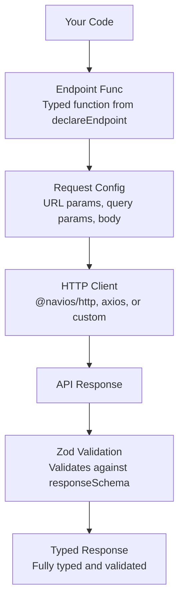

# Overview

`@navios/builder` is a type-safe HTTP API client builder for TypeScript. It provides a declarative way to define API endpoints with full Zod schema validation for requests, responses, and URL parameters.

**Package:** `@navios/builder`  
**License:** MIT  
**Peer Dependencies:** `zod` (^3.25.0 || ^4.0.0)

## Why Use Builder?

### Type Safety

Builder provides end-to-end type safety from your API definitions to your application code:

- **URL Parameters**: Automatically extracted and typed from `$paramName` syntax
- **Request Bodies**: Validated and typed using Zod schemas
- **Response Data**: Validated at runtime and typed at compile time
- **Query Parameters**: Full type safety with Zod validation

### Runtime Validation

All data is validated at runtime using Zod schemas:

- Invalid requests are caught before sending
- Invalid responses are caught and reported
- Type mismatches are detected early

### Declarative API

Define your API once in a clear, declarative way:

```typescript
const getUser = API.declareEndpoint({
  method: 'GET',
  url: '/users/$userId',
  responseSchema: userSchema,
})
```

### Flexible HTTP Clients

Works with any HTTP client that implements the `Client` interface:

- `@navios/http` (recommended)
- `axios`
- Custom clients

### Error Handling

Comprehensive error handling with:

- Unified `onError(event)` hook with a structured `BuilderErrorEvent` (`kind`, `endpoint`, `status`, `zodIssues`, `cause`, `body`)
- Envelope mode (`result: 'envelope'`) that returns errors as data alongside `data` / `response`
- **Error schema** - Map HTTP status codes to Zod schemas
- Type guards (`isHttpError`, `isValidationError`, `isNetworkError`, `isUnknownHttpError`) for typed error discrimination

## Core Concepts

### Builder Pattern

The builder creates a centralized API definition that:

- Declares typed endpoints with request/response schemas
- Manages HTTP client lifecycle
- Handles error transformation and validation
- Supports multiple response types (JSON, streams, multipart)

### Type Safety

- **URL Parameters**: Extracted from `$paramName` syntax and enforced at the type level
- **URL Parameter Validation**: Optional `urlParamsSchema` for runtime validation with Zod
- **Request Bodies**: Validated against Zod schemas before sending
- **Response Data**: Validated and typed automatically
- **Query Parameters**: Full Zod schema validation support
- **Error Responses**: Type-safe error handling with `errorSchema`

### Schema Validation

All data flows through Zod schemas:

- Request validation ensures data matches expected shape
- Response validation catches API contract violations
- Type inference provides full TypeScript support

## Architecture



## Key Features

### URL Parameter Extraction

```typescript
const getUser = API.declareEndpoint({
  method: 'GET',
  url: '/users/$userId/posts/$postId',
  responseSchema: postSchema,
})

// TypeScript enforces both parameters
await getUser({
  urlParams: {
    userId: '123',    // ✅ Required
    postId: '456',    // ✅ Required
  },
})
```

### URL Parameter Validation

Validate URL parameters at runtime with `urlParamsSchema`:

```typescript
const getUser = API.declareEndpoint({
  method: 'GET',
  url: '/users/$userId',
  responseSchema: userSchema,
  urlParamsSchema: z.object({
    userId: z.string().uuid(), // Must be a valid UUID
  }),
})
```

### Request/Response Validation

```typescript
const createUser = API.declareEndpoint({
  method: 'POST',
  url: '/users',
  requestSchema: z.object({
    name: z.string().min(1),
    email: z.string().email(),
  }),
  responseSchema: userSchema,
})

// Request is validated before sending
// Response is validated after receiving
const user = await createUser({
  data: { name: 'John', email: 'john@example.com' },
})
```

### Multiple Response Types

```typescript
// JSON responses
const getUser = API.declareEndpoint({ ... })

// Binary/Blob responses
const downloadFile = API.declareStream({ ... })

// Multipart uploads
const uploadFile = API.declareMultipart({ ... })
```

### Error Handling

Register a single `onError(event)` hook for cross-cutting concerns. The hook receives a structured `BuilderErrorEvent` on every failure path — HTTP, Zod validation (both error responses and 2xx body failures), and network:

```typescript
const API = builder({
  defaults: { result: 'envelope' }, // optional: envelope mode by default
  onError: (event) => {
    if (event.kind === 'validation') {
      logValidationError(event.zodIssues)
    } else if (event.kind === 'network') {
      logNetworkFailure(event.cause)
    } else {
      logHttpError(event.endpoint, event.status, event.body)
    }
  },
})
```

The v1 `onZodError` callback and `useDiscriminatorResponse` flag were removed — filter on `event.kind` and opt into envelope mode per-endpoint with `result: 'envelope'`.

### Error Schema

Handle different error responses by HTTP status code. Combine with `result: 'envelope'` so errors flow back as typed envelope variants instead of throwing:

```typescript
import { isHttpError } from '@navios/builder'

const getUser = API.declareEndpoint({
  method: 'GET',
  url: '/users/$userId',
  responseSchema: userSchema,
  errorSchema: {
    400: z.object({ error: z.string(), field: z.string() }),
    404: z.object({ error: z.literal('Not Found') }),
  },
  result: 'envelope',
})

const { data, error, response } = await getUser({ urlParams: { userId: '123' } })

if (isHttpError(error, 404)) {
  console.log('Not found:', error.body.error)
} else if (isHttpError(error, 400)) {
  console.log('Bad request:', error.body.error, error.body.field)
} else if (!error) {
  console.log('User:', data.name)
}
```

The v1 `isErrorStatus` / `isErrorResponse` guards and `__status` injection were removed — use `isHttpError(error, status?)` on the envelope error variant instead.

### Per-Endpoint Configuration

Configure timeout, headers, and transformation options per endpoint:

```typescript
const createUser = API.declareEndpoint({
  method: 'POST',
  url: '/users',
  responseSchema: userSchema,
  clientOptions: {
    timeout: 30000,
    headers: { 'X-Custom-Header': 'value' },
  },
})
```

## Quick Start

```typescript
import { builder } from '@navios/builder'
import { create } from '@navios/http'
import { z } from 'zod'

// 1. Create a builder instance
const API = builder()

// 2. Define your schemas
const userSchema = z.object({
  id: z.string(),
  name: z.string(),
  email: z.string().email(),
})

// 3. Declare endpoints
export const getUser = API.declareEndpoint({
  method: 'GET',
  url: '/users/$userId',
  responseSchema: userSchema,
})

export const createUser = API.declareEndpoint({
  method: 'POST',
  url: '/users',
  requestSchema: userSchema.omit({ id: true }),
  responseSchema: userSchema,
})

// 4. Provide the HTTP client
API.provideClient(create({ baseURL: 'https://api.example.com' }))

// 5. Use the endpoints
const user = await getUser({ urlParams: { userId: '123' } })
const newUser = await createUser({ data: { name: 'John', email: 'john@example.com' } })
```

## What's Next?

- [Getting Started](/docs/builder/builder/getting-started) - Installation and setup guide
- [Defining Endpoints](/docs/builder/builder/guides/defining-endpoints) - Learn how to declare endpoints
- [URL Parameters](/docs/builder/builder/guides/url-parameters) - Understand URL parameter handling
- [Request & Response Schemas](/docs/builder/builder/guides/schemas) - Master Zod schema patterns
- [Error Handling](/docs/builder/builder/guides/error-handling) - Handle errors gracefully
- [API Reference](/docs/builder/builder/api-reference) - Complete API documentation

