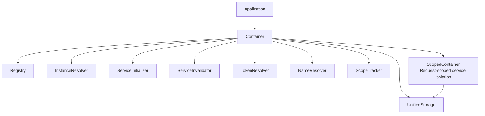

# Architecture Overview

Understanding the architecture of Navios DI helps you make better decisions about how to structure your services and dependencies.

## System Components

Navios DI consists of several core components that work together to provide dependency injection:

### Container

The `Container` is the main entry point for dependency injection. It provides a simplified, high-level API for managing services:

```typescript
const container = new Container()
const service = await container.get(MyService)
```

The Container provides a simplified API for:

- Getting service instances
- Invalidating services
- Managing request contexts
- Lifecycle management

The Container uses specialized components directly:

- **InstanceResolver**: Resolves service instances
- **ServiceInitializer**: Creates service instances
- **ServiceInvalidator**: Handles service invalidation
- **TokenResolver**: Processes injection tokens
- **NameResolver**: Generates deterministic instance names
- **ScopeTracker**: Tracks and validates scope relationships
- **UnifiedStorage**: Unified storage for all scopes

### Registry

The `Registry` stores service metadata and factory information. It acts as a central repository for all registered services, organized by Injection Tokens:

```typescript
const registry = new Registry()
const container = new Container(registry)
```

Services are registered automatically when decorated with `@Injectable()` or `@Factory()`. Each registration is stored with its Injection Token, scope, priority, and other metadata.

### ScopedContainer

The `ScopedContainer` provides isolated request context management. It's created via `container.beginRequest()`:

```typescript
const scoped = container.beginRequest('req-123')
const service = await scoped.get(RequestService)
await scoped.endRequest()
```

## Architecture Diagram



## Service Resolution Flow

When you request a service from the container, the following happens:

1. **Token Resolution**: The container identifies the service token (class or injection token)
2. **Registry Lookup**: The registry is checked for service metadata using the token
3. **Priority Selection**: If multiple services are registered for the token, the highest priority one is selected
4. **Instance Check**: The system checks if an instance already exists (for singletons)
5. **Dependency Resolution**: All dependencies are resolved recursively by their tokens
6. **Circular Dependency Check**: The system detects and prevents circular dependencies
7. **Instance Creation**: The service instance is created
8. **Dependency Injection**: Dependencies are injected into the service
9. **Lifecycle Initialization**: `onServiceInit()` is called if implemented
10. **Instance Storage**: The instance is stored (for singletons) or returned (for transients)

## Storage Strategy

Navios DI uses different storage strategies based on service scope:

### Unified Storage

Navios DI uses a unified storage architecture (`UnifiedStorage`) that handles all scopes:

- **Singleton**: Stored in the Container's UnifiedStorage instance
- **Transient**: Not stored - a new instance is created for each request
- **Request**: Stored in the ScopedContainer's UnifiedStorage instance

## Concurrent Resolution

Navios DI handles concurrent service resolution safely:

### Singleton Locking

When multiple concurrent requests try to create the same singleton, only one instance is created:

```typescript
// These run concurrently, but only ONE instance is created
const [service1, service2, service3] = await Promise.all([
  container.get(ExpensiveService),
  container.get(ExpensiveService),
  container.get(ExpensiveService),
])

// All are the same instance
console.log(service1 === service2 && service2 === service3) // true
```

### Request Locking

Request-scoped services have the same locking mechanism within a request context.

## Error Handling

The DI system provides comprehensive error handling:

### DIError

All DI-related errors extend `DIError` with specific error codes:

- `FactoryNotFound`: Service not registered
- `CircularDependency`: Circular dependency detected
- `InstanceDestroying`: Service is being destroyed
- `PriorityConflictError`: Multiple registrations with same priority

### Circular Dependency Detection

The system automatically detects circular dependencies and provides helpful error messages.

## Performance Considerations

### Lazy Initialization

Services are created only when requested.

### Instance Caching

Singleton instances are cached and reused.

### Async Resolution

Dependency resolution is fully async, enabling async initialization hooks, async factory methods, and async dependency resolution.

## Extension Points

Navios DI provides several extension points:

- **Custom Registries**: Use custom registries for modular service organization
- **Custom Injectors**: Provide custom injectors for special injection scenarios
- **Factory Context**: Factories receive a `FactoryContext` with additional capabilities

## Next Steps

- **[Core Concepts](/docs/di/di/architecture/core-concepts)** - Deep dive into core concepts and terminology