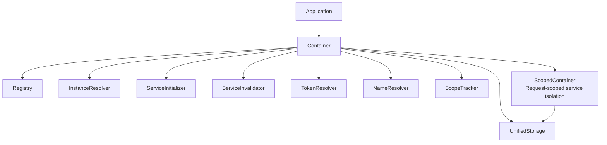

# Architecture Overview

Understanding the architecture of Navios DI helps you make better decisions about how to structure your services and dependencies.

## System Components

Navios DI consists of several core components that work together to provide dependency injection:

### Container

The `Container` is the main entry point for dependency injection. It provides a simplified, high-level API for managing services:

```typescript
const container = new Container()
const service = await container.get(MyService)
```

The Container provides a simplified API for:

- Getting service instances
- Invalidating services
- Managing request contexts
- Lifecycle management

The Container uses specialized components directly:

- **InstanceResolver**: Resolves service instances
- **ServiceInitializer**: Creates service instances (formerly Instantiator)
- **ServiceInvalidator**: Handles service invalidation (formerly Invalidator)
- **TokenResolver**: Processes injection tokens (formerly TokenProcessor)
- **NameResolver**: Generates deterministic instance names
- **ScopeTracker**: Tracks and validates scope relationships
- **UnifiedStorage**: Unified storage for all scopes (replaces SingletonStorage, RequestStorage, RequestContext)

### Registry

The `Registry` stores service metadata and factory information. It acts as a central repository for all registered services:

```typescript
const registry = new Registry()
const container = new Container(registry)
```

Services are registered automatically when decorated with `@Injectable()` or `@Factory()`.

### ScopedContainer

The `ScopedContainer` provides isolated request context management. It's created via `container.beginRequest()`:

```typescript
const scoped = container.beginRequest('req-123')
const service = await scoped.get(RequestService)
await scoped.endRequest()
```

## Architecture Diagram



## Service Resolution Flow

When you request a service from the container, the following happens:

1. **Token Resolution**: The container identifies the service token (class or injection token)
2. **Registry Lookup**: The registry is checked for service metadata
3. **Instance Check**: The system checks if an instance already exists (for singletons)
4. **Dependency Resolution**: All dependencies are resolved recursively
5. **Circular Dependency Check**: The system detects and prevents circular dependencies
6. **Instance Creation**: The service instance is created
7. **Dependency Injection**: Dependencies are injected into the service
8. **Lifecycle Initialization**: `onServiceInit()` is called if implemented
9. **Instance Storage**: The instance is stored (for singletons) or returned (for transients)

## Storage Strategy

Navios DI uses different storage strategies based on service scope:

### Unified Storage

Navios DI uses a unified storage architecture (`UnifiedStorage`) that handles all scopes:

- **Singleton**: Stored in the Container's UnifiedStorage instance
- **Transient**: Not stored - a new instance is created for each request
- **Request**: Stored in the ScopedContainer's UnifiedStorage instance

```typescript
// Different containers store different singleton instances
const container1 = new Container()
const container2 = new Container()

const service1 = await container1.get(SingletonService)
const service2 = await container2.get(SingletonService)

console.log(service1 !== service2) // true (different containers)

// Transient services are not stored
const service3 = await container.get(TransientService)
const service4 = await container.get(TransientService)

console.log(service3 === service4) // false (new instance each time)

// Request-scoped services are stored per ScopedContainer
const scoped1 = container.beginRequest('req-1')
const scoped2 = container.beginRequest('req-2')

const service5 = await scoped1.get(RequestService)
const service6 = await scoped2.get(RequestService)

console.log(service5 === service6) // false (different requests)
```

## Concurrent Resolution

Navios DI handles concurrent service resolution safely:

### Singleton Locking

When multiple concurrent requests try to create the same singleton, only one instance is created:

```typescript
// These run concurrently, but only ONE instance is created
const [service1, service2, service3] = await Promise.all([
  container.get(ExpensiveService),
  container.get(ExpensiveService),
  container.get(ExpensiveService),
])

// All are the same instance
console.log((service1 === service2) === service3) // true
```

### Request Locking

Request-scoped services have the same locking mechanism within a request context:

```typescript
const scoped = container.beginRequest('req-123')

// Concurrent resolution within the same request
const [service1, service2] = await Promise.all([
  scoped.get(RequestService),
  scoped.get(RequestService),
])

// Same instance within the request
console.log(service1 === service2) // true
```

## Event System

Navios DI includes an event bus for lifecycle events:

- **Service Created**: Fired when a service instance is created
- **Service Destroyed**: Fired when a service is invalidated

The event system enables:

- Automatic invalidation propagation
- Service lifecycle tracking
- Debugging and monitoring

## Error Handling

The DI system provides comprehensive error handling:

### DIError

All DI-related errors extend `DIError` with specific error codes:

```typescript
import { DIError, DIErrorCode } from '@navios/di'

try {
  await container.get(NonExistentService)
} catch (error) {
  if (error instanceof DIError) {
    switch (error.code) {
      case DIErrorCode.FactoryNotFound:
        // Service not registered
        break
      case DIErrorCode.CircularDependency:
        // Circular dependency detected
        break
      case DIErrorCode.InstanceDestroying:
        // Service is being destroyed
        break
    }
  }
}
```

### Circular Dependency Detection

The system automatically detects circular dependencies and provides helpful error messages:

```typescript
// Error: Circular dependency detected: ServiceA -> ServiceB -> ServiceA
```

## Performance Considerations

### Lazy Initialization

Services are created only when requested:

```typescript
// Service is not created until this line
const service = await container.get(MyService)
```

### Instance Caching

Singleton instances are cached and reused:

```typescript
// First call creates the instance
const service1 = await container.get(SingletonService)

// Second call returns cached instance
const service2 = await container.get(SingletonService)
```

### Async Resolution

Dependency resolution is fully async, enabling:

- Async initialization hooks
- Async factory methods
- Async dependency resolution

## Extension Points

Navios DI provides several extension points:

### Custom Injectors

You can provide custom injectors for special injection scenarios:

```typescript
import { getInjectors } from '@navios/di'

const customInjectors = getInjectors()

const container = new Container(registry, logger, customInjectors)
```

### Custom Registry

Use custom registries for modular service organization:

```typescript
const userRegistry = new Registry()
const paymentRegistry = new Registry()

@Injectable({ registry: userRegistry })
class UserService {}

@Injectable({ registry: paymentRegistry })
class PaymentService {}
```

### Factory Context

Factories receive a `FactoryContext` with additional capabilities:

```typescript
@Factory()
class MyFactory {
  create(ctx: FactoryContext) {
    // Inject dependencies
    const service = await ctx.inject(OtherService)

    // Register cleanup callbacks
    ctx.addDestroyListener(() => {
      // Cleanup logic
    })

    return newInstance
  }
}
```

## Best Practices

1. **Use Container for Application Setup**: Create one container per application
2. **Leverage ScopedContainer for Requests**: Use request contexts for web applications
3. **Implement Lifecycle Hooks**: Use `OnServiceInit` and `OnServiceDestroy` for resource management
4. **Handle Errors Gracefully**: Catch and handle `DIError` appropriately
5. **Use Appropriate Scopes**: Choose the right scope for each service

For more details, see the [Best Practices](/docs/di/di/best-practices) guide.
