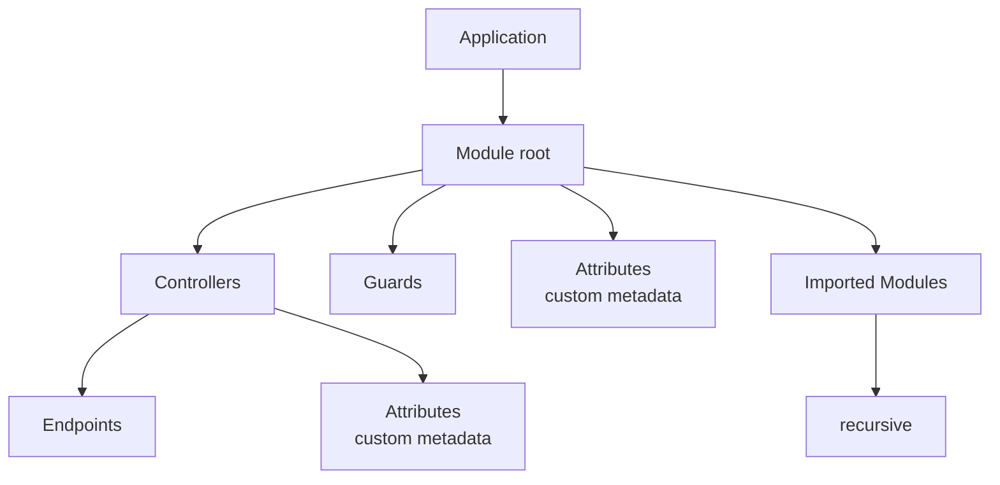

# Architecture

Navios Server follows a modular, decorator-based architecture inspired by modern backend frameworks. Understanding these building blocks is essential for structuring your applications.

## Application Structure



## Core Building Blocks

### Modules

Modules are the organizational units of a Navios application. They group related controllers and can import other modules to compose functionality.

```typescript
@Module({
  controllers: [UserController, ProductController],
  imports: [DatabaseModule, AuthModule],
  guards: [AuthGuard],
})
class AppModule {}
```

Every application has a **root module** that serves as the entry point. The root module imports all other modules needed by the application.

### Controllers

Controllers handle incoming HTTP requests and return responses. They contain endpoints that map to specific HTTP routes.

```typescript
@Controller()
class UserController {
  @Endpoint(getUser)
  async getUser(params: EndpointParams<typeof getUser>) {
    return { id: params.urlParams.userId, name: 'John' }
  }
}
```

### Endpoints

Endpoints are methods decorated with `@Endpoint()` that define the HTTP route, method, and schemas for a specific operation. Endpoints are defined using `@navios/builder` for type-safe API contracts.

```typescript
const getUser = API.declareEndpoint({
  method: 'GET',
  url: '/users/$userId',
  responseSchema: userSchema,
})
```

:::tip
For comprehensive information about defining endpoints with Builder, see the [Builder documentation](/docs/builder/guides/defining-endpoints).
:::

### Guards

Guards implement authorization logic that runs before an endpoint executes. They can allow or deny access based on the request context.

```typescript
@Injectable()
class AuthGuard implements CanActivate {
  async canActivate(context: AbstractExecutionContext): Promise<boolean> {
    const request = context.getRequest()
    return !!request.headers.authorization
  }
}
```

## Dependency Injection

Navios is built on `@navios/di`, providing a powerful dependency injection system. Services are automatically resolved and injected where needed.

```typescript
@Injectable()
class UserService {
  private db = inject(DatabaseService)

  async findById(id: string) {
    return this.db.users.findUnique({ where: { id } })
  }
}

@Controller()
class UserController {
  private userService = inject(UserService)

  @Endpoint(getUser)
  async getUser(params: EndpointParams<typeof getUser>) {
    return this.userService.findById(params.urlParams.userId)
  }
}
```

:::tip
For more details on using services and dependency injection, see the [Services & Dependency Injection guide](/docs/server/guides/services). For advanced DI topics including injection tokens, factories, and lifecycle management, see the [DI documentation](/docs/di).
:::

## Adapters

Navios is adapter-agnostic, meaning it can run on different HTTP runtimes. The adapter layer abstracts away the underlying server implementation.

Currently supported adapters:

- **Fastify** (`@navios/adapter-fastify`) - High-performance Node.js server
- **Bun** (`@navios/adapter-bun`) - Native Bun HTTP server

```typescript
import { defineFastifyEnvironment } from '@navios/adapter-fastify'

const app = await NaviosFactory.create(AppModule, {
  adapter: defineFastifyEnvironment(),
})
```

## Key Principles

| Principle            | Description                                      |
| -------------------- | ------------------------------------------------ |
| **Decorator-Based**  | Use decorators for metadata definition           |
| **Type-Safe**        | Full TypeScript integration with Zod schemas     |
| **Modular**          | Organize code into modules with clear boundaries |
| **Adapter-Agnostic** | Support multiple HTTP runtimes                   |
| **DI-Powered**       | Built on `@navios/di` for dependency injection   |
| **Extensible**       | Custom attributes for cross-cutting concerns     |

## Related Documentation

- [Key Concepts](/docs/server/overview/key-concepts) - Core concepts that power Navios
- [Request Lifecycle](/docs/server/overview/request-lifecycle) - How requests flow through Navios
- [Services & Dependency Injection](/docs/server/guides/services) - Using services with DI
- [Builder: Defining Endpoints](/docs/builder/guides/defining-endpoints) - Type-safe endpoint definitions
- [DI: Getting Started](/docs/di/getting-started) - Dependency injection fundamentals
