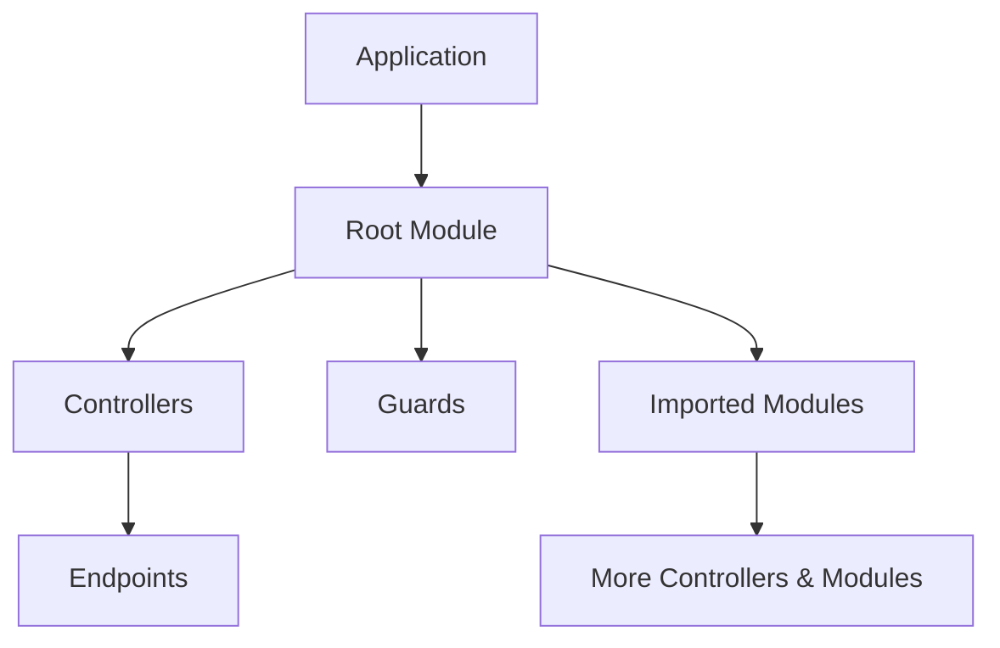

# Architecture

Navios Server follows a modular, decorator-based architecture. Understanding these building blocks helps you structure applications effectively.

## Application Structure



A Navios application consists of:

- **Modules** - Organizational units that group related functionality
- **Controllers** - Classes that handle HTTP requests
- **Endpoints** - Methods that define routes and handle specific operations
- **Guards** - Authorization logic that runs before endpoints
- **Services** - Business logic injected via dependency injection

## Modules

Modules group related controllers and define boundaries between different parts of your application. Every application has a **root module** that serves as the entry point.

```typescript
@Module({
  controllers: [UserController, ProductController],
  imports: [DatabaseModule, AuthModule],
  guards: [AuthGuard],
})
class AppModule {}
```

Modules can import other modules to compose functionality. Guards defined at module level apply to all controllers within that module.

For detailed module patterns, see the [Modules guide](/docs/server/guides/modules).

## Controllers & Endpoints

Controllers handle incoming HTTP requests. They contain endpoint methods decorated with `@Endpoint()` that map to specific routes.

```typescript
@Controller()
class UserController {
  @Endpoint(getUser)
  async getUser(params: EndpointParams<typeof getUser>) {
    return { id: params.urlParams.userId, name: 'John' }
  }
}
```

Endpoints are defined using `@navios/builder` with Zod schemas, providing:

- **Request validation** - Incoming data is automatically validated
- **Response validation** - Responses are checked against the schema
- **Full TypeScript types** - Complete autocompletion and type checking

For endpoint definition syntax, see the [Builder documentation](/docs/builder/guides/defining-endpoints). For controller patterns, see the [Controllers guide](/docs/server/guides/controllers).

## Guards

Guards implement authorization logic that runs before endpoint handlers. They control access to your API.

```typescript
@Injectable()
class AuthGuard implements CanActivate {
  async canActivate(context: AbstractExecutionContext): Promise<boolean> {
    const request = context.getRequest()
    return !!request.headers.authorization
  }
}
```

Guards can be applied at module level (affecting all controllers) or endpoint level (affecting specific routes). See the [Guards guide](/docs/server/guides/guards).

## Dependency Injection

Navios is built on `@navios/di`. Services are decorated with `@Injectable()` and injected using `inject()`:

```typescript
@Injectable()
class UserService {
  private db = inject(DatabaseService)

  async findById(id: string) {
    return this.db.users.findUnique({ where: { id } })
  }
}

@Controller()
class UserController {
  private userService = inject(UserService)

  @Endpoint(getUser)
  async getUser(params: EndpointParams<typeof getUser>) {
    return this.userService.findById(params.urlParams.userId)
  }
}
```

### Service Scopes

Services have different lifetimes:

| Scope       | Description                                       |
| ----------- | ------------------------------------------------- |
| `singleton` | One instance for the entire application (default) |
| `transient` | New instance every time it's injected             |
| `request`   | One instance per HTTP request                     |

```typescript
@Injectable({ scope: InjectableScope.Request })
class RequestContext {
  userId: string | null = null
}
```

For more on services and DI, see the [Services guide](/docs/server/guides/services) and [DI documentation](/docs/di).

## Adapters

Navios is adapter-agnostic, supporting different HTTP runtimes:

- **Fastify** (`@navios/adapter-fastify`) - High-performance Node.js server
- **Bun** (`@navios/adapter-bun`) - Native Bun HTTP server

```typescript
import { defineFastifyEnvironment } from '@navios/adapter-fastify'

const app = await NaviosFactory.create(AppModule, {
  adapter: defineFastifyEnvironment(),
})
```

For adapter-specific configuration, see [Fastify Adapter](/docs/server/adapters/fastify) or [Bun Adapter](/docs/server/adapters/bun).

## Decorators

Navios uses TypeScript decorators to attach metadata to classes and methods:

| Decorator | Purpose |
|-----------|---------|
| `@Module({...})` | Marks class as a module |
| `@Controller()` | Marks class as a controller |
| `@Injectable()` | Marks class as injectable service |
| `@Endpoint(...)` | Marks method as HTTP endpoint |
| `@UseGuards(...)` | Attaches guards to endpoint |
| `@HttpCode(201)` | Sets response status code |
| `@Header('X-Custom', 'value')` | Sets response header |

## Key Principles

| Principle            | Description                                      |
| -------------------- | ------------------------------------------------ |
| **Decorator-Based**  | Use decorators for metadata definition           |
| **Type-Safe**        | Full TypeScript integration with Zod schemas     |
| **Modular**          | Organize code into modules with clear boundaries |
| **Adapter-Agnostic** | Support multiple HTTP runtimes                   |
| **DI-Powered**       | Built on `@navios/di` for dependency injection   |

## Next Steps

- [Request Lifecycle](/docs/server/overview/request-lifecycle) - How requests flow through Navios
- [Controllers & Endpoints](/docs/server/guides/controllers) - Detailed routing and request handling
- [Services & DI](/docs/server/guides/services) - Business logic and dependency injection
- [Guards](/docs/server/guides/guards) - Authorization and access control
