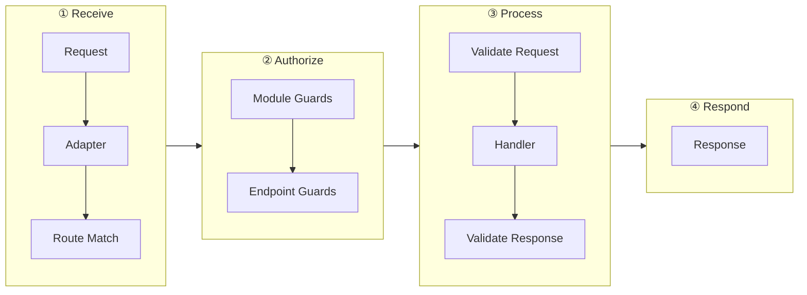

# Request Lifecycle

Understanding how requests flow through Navios helps you debug issues and implement features at the right layer.

## Request Flow



## Phase Details

### 1. HTTP Adapter

The adapter receives the raw HTTP request and normalizes it into a format Navios can work with. This includes parsing headers, body, and URL parameters.

### 2. Route Matching

Navios matches the request URL and method against registered endpoints. URL parameters (e.g., `/users/$userId`) are extracted at this stage.

### 3. Module Guards

Guards registered at the module level run first. If any guard returns `false` or throws an exception, the request is rejected.

```typescript
@Module({
  controllers: [UserController],
  guards: [RateLimitGuard, AuthGuard],
})
class AppModule {}
```

### 4. Controller Initialization

The controller class is instantiated (if not already cached) and its dependencies are resolved through the DI container.

### 5. Endpoint Guards

Guards applied directly to endpoints via `@UseGuards()` run after module guards.

```typescript
@Controller()
class AdminController {
  @Endpoint(deleteUser)
  @UseGuards(AdminGuard)
  async deleteUser(params: EndpointParams<typeof deleteUser>) {
    // Only admins reach here
  }
}
```

### 6. Request Validation

If the endpoint has defined schemas (query, body, URL params), Navios validates the incoming data using Zod. Invalid requests result in a `400 Bad Request` response.

### 7. Endpoint Method Execution

Your endpoint handler runs with validated, typed parameters. This is where your business logic executes.

```typescript
@Endpoint(createUser)
async createUser(params: EndpointParams<typeof createUser>) {
  // params.data is validated and typed
  return this.userService.create(params.data)
}
```

### 8. Response Validation

If a response schema is defined, Navios validates the returned data. This catches bugs where your code returns malformed responses.

### 9. HTTP Response

The validated response is serialized and sent to the client through the adapter.

## Error Handling

Exceptions thrown at any phase are caught and converted to HTTP responses:

| Exception | Status Code |
|-----------|-------------|
| `BadRequestException` | 400 |
| `UnauthorizedException` | 401 |
| `ForbiddenException` | 403 |
| `NotFoundException` | 404 |
| `ConflictException` | 409 |
| `InternalServerErrorException` | 500 |
| Validation Error | 400 |
| Unhandled Error | 500 |

**HttpException** responses maintain backward compatibility with the original format. Framework-level errors (validation errors, guard rejections, not found routes, unhandled errors) use **RFC 7807 Problem Details** format for standardized, machine-readable error responses.

```typescript
import { NotFoundException } from '@navios/core'

@Endpoint(getUser)
async getUser(params: EndpointParams<typeof getUser>) {
  const user = await this.userService.findById(params.urlParams.userId)
  if (!user) {
    throw new NotFoundException('User not found')
  }
  return user
}
```
